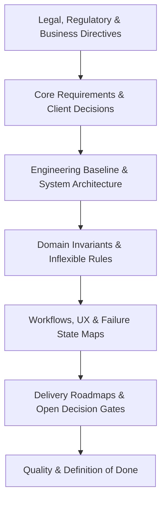
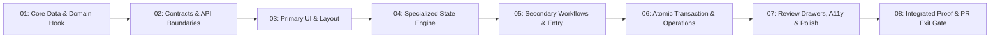
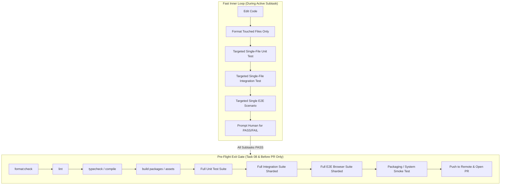
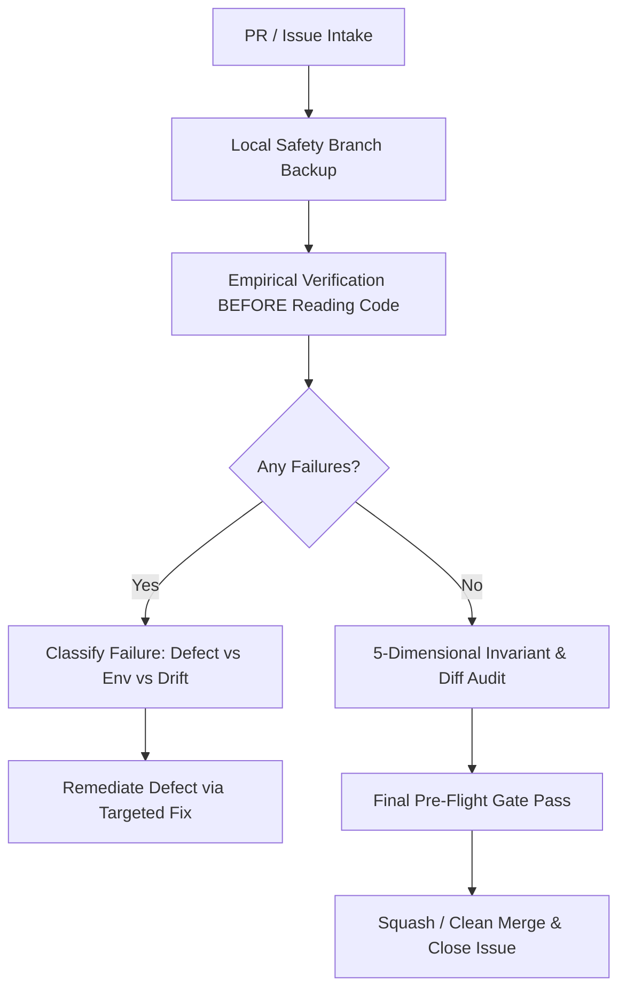

# The Universal Agentic Engineering Operating System (EOS)
## A Battle-Tested Framework for Autonomous & Pair-Programming Agent Workflows

---

## 1. Executive Overview & Foundational Philosophy

This framework formalizes an industrial-grade **Engineering Operating System (EOS)** designed for complex, mission-critical software development driven by autonomous or pair-programming AI agents (e.g., Antigravity, Claude Code, Codex).

The core thesis of this operating system is:
> **Autonomous AI agents achieve elite engineering quality only when constrained by unambiguous documentation hierarchies, empirical verification seams, strict scope quarantine, and separate inner-development vs. outer-exit loops.**

Without this system, AI agents typically:
1. Suffer from context collapse and invent speculative abstractions.
2. Break unrelated features through global style or shared utility bleed.
3. Waste hours running monolithic test suites on trivial intermediate edits.
4. Hallucinate passes when mocks hide real database, network, or OS failures.
5. Push unverified or unformatted code that clogs CI pipelines.

This specification documents the complete lifecycle—from architecture and local ticket tracking to testing seams, CI failure prevention, GitHub review remediation, and multi-agent delegation. It is designed to be **100% stack-agnostic**.

---

## 2. Documentation Architecture & Single Source of Truth (SSOT)

Agents require a deterministic hierarchy of knowledge. When files disagree, agents must know exactly which document wins.



### 2.1 The Core Documentation Map
Every project should maintain a dedicated documentation directory (e.g., `docs/`) with the following strict separation of concerns:

| Document | Canonical Purpose | Rule on Conflict |
| :--- | :--- | :--- |
| **`CONTEXT.md`** (Root) | **Ubiquitous Glossary & Canonical Language.** Maps business terms to exact code identifiers. Prevents agents from using loose synonyms (e.g., strictly distinguishing between "Order", "Draft", "Invoice", "Settlement"). | Canonical truth for naming. |
| **`docs/README.md`** | **Source Authority & Reading Order.** Defines the exact reading sequence for agents and establishes the conflict resolution rule. | Dictates precedence across all docs. |
| **`docs/product.md`** | **Users, Scope, Personas, Plans & Exclusions.** Declares what the software is, who uses it, and explicitly lists **excluded** features so agents never re-invent them. | Business scope authority. |
| **`docs/domain.md`** | **Non-Negotiable Invariants.** Mathematical, relational, and business laws that no PR or agent may violate (e.g., exact integer currency, double-entry balance, inventory conservation, immutability of posted records). | Overrules code convenience. |
| **`docs/architecture.md`** | **System Boundaries & Structural Constraints.** Process boundaries, network topology, runtime tiers, IPC security guardrails, data ownership, and extraction rules (when a module earns package/microservice extraction). | Structural authority. |
| **`docs/workflows.md`** | **End-to-End User Journeys & Failure States.** Step-by-step procedures, optimistic updates, offline queues, rollback sequences, and hardware/network recovery flows. | Behavioral authority. |
| **`docs/quality.md`** | **Definition of Done & Verification Matrices.** Exhaustive matrix defining required evidence per layer (Unit, Persistence, Contract, UI, Smoke, OS Release). Accessibility and performance standards. | Testing & gating authority. |
| **`docs/open-decisions.md`** | **Gated Structural Decisions & Engineering Defaults.** Documents decisions that cannot yet be settled (e.g., pending third-party provider, legal approval). Declares named engineering defaults to build against until the gate closes. | Prevents guessing. |
| **`docs/traceability.md`** | **Requirement-to-Test Traceability Matrix.** Exhaustive mapping from original user requirements to architectural ADRs, database migrations, and automated test paths. | Audit & coverage proof. |
| **`docs/adr/`** | **Architectural Decision Records.** Consequential, hard-to-reverse architectural choices. Updated only when a fundamental choice is superseded. | Historical rationale. |

### 2.2 Requirement Vocabulary Standard
Requirements in documents must use formal, unbending language:
- **`Required`**: Confirmed by governing baseline or client. Must be implemented and tested.
- **`Provisional target`**: Approved engineering target to be validated on real target hardware/environment.
- **`Release-gated`**: The architectural hook is required, but the runtime capability remains locked behind an open gate until explicit evidence is supplied.
- **`Deferred`**: Explicitly postponed to a future phase. The code must preserve data integrity hooks, but UI/APIs are not built.
- **`Excluded`**: Permanently rejected or out-of-scope. Must be removed from menus, routes, and schemas. Agents are strictly forbidden from re-introducing excluded items.

---

## 3. The Agent Working Agreement (`AGENTS.md`)

The root `AGENTS.md` (or `CLAUDE.md`) is the operational constitution loaded into the agent's context on every invocation. It must mandate:

### 3.1 Non-Negotiable Engineering Rules
1. **No Speculative Abstractions:** Implement the simplest concrete code that satisfies the requirement. No premature generic classes, plugin hooks, or unneeded indirection layers.
2. **One Vertical Slice at a Time:** Deliver end-to-end working software across all layers (DB -> API -> UI -> Test) before starting the next feature. Never deliver wide, half-implemented horizontal layers.
3. **No Dead-Code Compatibility Layers:** Never retain backward compatibility with prototypes, obsolete scaffolds, or legacy naming. Remove superseded paths completely. Live production data is preserved via forward database migrations, not application adapter bloat.
4. **Prefer Established Libraries Over Custom Hacks:** Research well-maintained, mature libraries first. Inspect their API docs and types thoroughly before writing custom implementations.
5. **Real Infrastructure Over Mocking ("The Real Seams Principle"):** Unit tests test pure logic; integration tests must test against real databases (PostgreSQL/MySQL/Redis), real HTTP daemons, real browsers, and real OS filesystems. Never fake away data integrity.
6. **Local Host Limitations are Not Permission to Weaken Security:** If a local developer workstation lacks elevated OS permissions (e.g., Windows CNG keys, Linux eBPF, raw socket binds), scope those tests to run in privileged CI jobs. Never edit production code to bypass environment limits.

---

## 4. Local Issue Tracking & Epic Decomposition (`.scratch/`)

Rather than polluting the active git history with transient planning drafts, or relying solely on external web trackers that agents cannot read offline, all active epics and features are tracked locally inside a `.scratch/` directory.

### 4.1 Directory Layout
For every milestone, feature, or issue:
```text
.scratch/
└── issue-<NN>-<feature-slug>/
    ├── spec.md              # Epic specification & acceptance contract
    ├── map.md               # Visual DAG, task register & migration reservations
    ├── GATES.md             # External gates & temporary defaults (optional)
    ├── handoff-summary.md   # Handoff log between subtasks
    └── issues/              # Sequential, vertically sliced subtasks
        ├── 01-<slug>.md
        ├── 02-<slug>.md
        ├── ...
        └── 08-<slug>.md
```

### 4.2 Standard 8-Slice Tracer-Bullet Decomposition
Complex epics are systematically decomposed into 8 sequential tracer-bullets:



1. **Task 01 (Persistence & Domain Hook):** Database schema, forward migration, concurrency lock order hook, core entity validation.
2. **Task 02 (Contracts & Cross-Document Boundaries):** Strict API/IPC runtime schemas (e.g. Zod, Pydantic, Protobuf), error definitions, rejection rules.
3. **Task 03 (Primary UI Workspace):** Visual layout transplant, scoped component styling, primary list/grid views, baseline state wiring.
4. **Task 04 (Specialized Security & State Machine):** Authorization policies, step-up authentication, offline validation, complex state transitions.
5. **Task 05 (Secondary Workflows & Form Entry):** Complex input grids, keyboard shortcuts, draft auto-saving, client-side validation.
6. **Task 06 (Atomic Posting & Operational Execution):** Server-authoritative posting endpoint, sequence numbering, immutable audit log, outbox events, crash recovery.
7. **Task 07 (Review Drawers, Audit History, A11y & Polish):** History drawers, bilingual/i18n, RTL/LTR layout balance, light/dark themes, WCAG accessibility.
8. **Task 08 (Integrated Proof & PR Exit Gate):** Full allow/deny security matrix, concurrency race proof, full test suite pre-flight gate, packaging smoke test, PR creation.

### 4.3 The Mandatory 11-Section Ticket Template
Every subtask file (`issues/NN-<slug>.md`) must adhere strictly to the **11-Section Template**:

```markdown
# Implementer Mission: Task NN — <Task Title>

## 1. Implementer Mission & Instructions
- Worktree context, base branch, starting commit.
- Mandatory reading: AGENTS.md, CONTEXT.md, spec.md, map.md before authoring code.

## 2. User Story
- As <role>, I want <capability>, so that <business outcome>.

## 3. Source Requirements & Invariants
- Governing rules from docs/domain.md and architecture.md.
- Mathematical precision, atomicity, immutability, offline behavior, and security invariants.

## 4. Scope of Changes
- Exhaustive list of declared files to create or modify:
  - Database schemas & migrations
  - Backend domain services, controllers, persistence
  - Contracts & DTOs
  - Frontend components, styles, message catalogs
  - Automated tests (unit, integration, browser)

## 5. Acceptance Scenarios
- **Happy Path:** Expected end-to-end workflow.
- **Security & Permissions:** Allow vs. deny matrix, role validation, tenant isolation.
- **UI & Accessibility:** Standard viewport, RTL/LTR, dark/light themes, keyboard navigation.
- **Failure & Recovery:** Concurrency collisions, network drops, crash recovery, atomic rollback.
- **Independent Proof:** Exact financial, cryptographic, or state oracle assertions.

## 6. Targeted Test Scope (Inner Loop Only)
- STRICT INNER-LOOP BUDGET (< 35 Min).
- FORBIDDEN: Monolithic full-repo suites, full browser suites, full packaging builds.
- ONLY targeted test commands for the exact modified files:
  - Unit: `<command-for-single-unit-test>`
  - Integration: `<command-for-single-integration-test>`
  - Typecheck: `<command-for-targeted-typecheck>`
  - Browser: `<command-for-single-e2e-scenario>`
  - Formatting: `<format-touched-files-only>`

## 7. Risks & Invariant Protections
- Deadlock prevention, race condition prevention, zero style bleed into unrelated components.

## 8. Manual Test Protocol & User Approval Gate
- Step-by-step instructions for running visual/interactive verification.
- Verification checklist: Viewport constraints, keyboard tabs, color themes, error states.
- **Mandatory Human Approval Question:**
  The agent must halt execution, keep the application visible/accessible, and ask:
  > *"Task NN automated checks and manual rehearsal complete. Please review the application state and evidence. Do you approve: PASS or FAIL?"*

## 9. Handoff Protocol
- Record evidence in `evidence/issue-<num>/task-NN-evidence.md`.
- Update `.scratch/issue-<num>/issues/NN-*.md` status to resolved and update `map.md`.
- Scoped conventional commit: `feat(<module>): <description> (Task NN)`.
- **STRICT REMOTE PUSH POLICY:**
  DO NOT PUSH TO REMOTE BEFORE EXPLICIT HUMAN PASS! Commits remain local until human confirms.

## 10. Completion Evidence
- Artifact paths, screenshots, test execution logs, exit codes.

## 11. Answer
- Initialized to: `Pending implementation and explicit human initiation.`
```

---

## 5. UI Implementation & Prototype Fidelity Rules

When building frontend applications, AI agents are notorious for inventing sloppy, inconsistent UI layouts. The **Prototype Fidelity** methodology eliminates this failure mode:

### 5.1 The Prototype as Visual Truth
1. **Never Invent Custom Layouts:** If a prototype, design mock, or Figma exists, it is the sole authority for layout, padding, font sizes, button positions, cards, and modal hierarchy.
2. **Visual Transplant Pattern:**
   - Extract the visual markup, DOM tree, and styling classes directly from the design/prototype artifact.
   - Strip out prototype mock data, hardcoded state, client-side floating-point math, and mock storage.
   - Wire the clean visual components to typed backend contracts, server-authoritative calculations, and internationalization message dictionaries.
3. **Full Depth / Exhaustive Nested Surfaces:**
   - A screen implementation is strictly incomplete if sub-tabs, filter drawers, adjustment dialogs, confirmation modals, or slide-over review panels are omitted or left as stubbed placeholders.
   - **Zero Native Browser Dialogs:** Never use `window.alert()`, `window.confirm()`, or native prompt dialogs. They freeze threads, break headless CI runs, cannot be styled or themed, and ruin accessibility. All dialogs must be accessible, custom in-app modal components.
4. **Strict Scope Isolation (Zero Global Style Bleed):**
   - Never modify global CSS resets or shared shell utility classes (e.g., global `.btn`, `.card`, `.input`) to fix a feature-specific layout.
   - Prefix all feature-specific styles under an isolated container root (e.g., `.purchasing-root .table-row`).
   - Before finishing a subtask, verify that unrelated core screens still render identically without visual shifts.

---

## 6. The Dual-Speed Testing Architecture: Inner Loop vs. Outer Gate

The single largest source of wasted time in agentic workflows is running monolithic test suites during routine feature development. The workflow strictly splits testing into two tiers:



### 6.1 Inner Loop Rules (Intermediate Tasks 01–07)
- **Time Budget:** Under 35 minutes per cycle.
- **Prohibitions:**
  - Never run full-repo test commands (`npm test`, `pytest`, `cargo test`, `pnpm verify`).
  - Never run full browser test suites (100+ tests).
  - Never trigger slow release packaging (e.g. Electron ASAR packaging, Docker multi-stage release builds).
  - Never run full-repo formatters.
- **Allowed Targeted Checks:**
  - Format touched files only (`prettier --write <files>`, `black <files>`, etc.).
  - Compile/typecheck the affected module or package.
  - Run the single unit test file covering the modified code.
  - Run the single integration test file against the local test database.
  - Run the single headless/headed E2E test scenario verifying the screen.

### 6.2 Pre-Flight Exit Gate (Task 08 & Before PR)
Run once during the final integration subtask or immediately prior to opening a PR:
1. **Code Formatting Check:** Ensure zero formatting drift (`format:check`).
2. **Linter:** Zero lint warnings/errors.
3. **Typecheck / Static Analysis:** Monorepo-wide type safety.
4. **Full Unit Suite:** Complete domain validation across all modules.
5. **Full Integration Suite:** Real-database persistence, transaction rollback, and concurrency verification (sharded across test runners).
6. **Full E2E / Browser Suite:** Complete multi-viewport, multi-locale, and keyboard flow verification.
7. **Packaging / Smoke Test:** Build the actual deployable binary/container, launch it, and assert health endpoints and runtime isolation.

---

## 7. CI Pipeline Architecture & Failure Prevention

CI pipelines must be rock-solid, parallelized, and guarded against common cross-platform and headless failures.

### 7.1 Modern CI Pipeline Matrix
A robust GitHub Actions workflow (e.g. `verify.yml`) should be structured into isolated jobs:
- **`static-and-unit`** (Ubuntu): Fast lint, format check, monorepo typecheck, build, and pure unit tests.
- **`integration`** (Ubuntu): Real database services (PostgreSQL/MySQL service containers). Runs integration tests using matrix sharding (`--shard=1/2`, `--shard=2/2`).
- **`browser / e2e`** (Ubuntu): Headless browser execution against running API instances. Runs E2E tests using matrix sharding (`--shard=1/4` .. `4/4`).
- **`smoke`** (Ubuntu / Linux / Windows): Packages the release artifact (Electron app, Docker image, or binary) and boots it in a headless environment (using `xvfb` on Linux) to prove launch integrity.
- **`platform-proof`** (OS-specific, e.g. Windows/macOS runner): Triggered on demand or on PR merge to prove platform-native cryptographic, keychain, or hardware mechanics without exhausting expensive CI minutes.
- **`verify-gate`**: Final aggregate gate that requires all parallel jobs to pass before allowing branch merge.

### 7.2 Non-Negotiable CI Invariants
1. **Deterministic Lockfiles:** Always run dependency installation with `--frozen-lockfile` (or equivalent).
2. **Cross-Platform File Descriptors:**
   - When calling file flush APIs (`fsync` / `FlushFileBuffers`), always open files with read-write modes (`r+`), not read-only (`r`), because Windows Win32 rejects read-only descriptors with `EPERM`.
3. **POSIX vs. Windows Permissions:**
   - Scope POSIX permission assertions (`mode & 0o777`) behind `if (process.platform !== "win32")`. Windows NTFS relies on ACLs, not POSIX mode bits.
4. **Headless Modal Freezes:**
   - Synchronous UI modal dialogs deadlock headless CI environments. Always use asynchronous message handlers in application code.
5. **Viewport Overflow Resilience:**
   - In E2E tests, action buttons must remain visible within standard viewports (e.g. 1280x800). All scrolling containers must specify `overflow: auto` and `min-height: 0` / `min-block-size: 0` to prevent Playwright `toBeInViewport()` timeouts.

---

## 8. GitHub Flow & The PR Review/Remediation Lifecycle (`pr-review-remediate`)

When an agent is assigned to review, verify, or remediate a Pull Request, it must follow an empirical, fact-based protocol rather than superficial code inspection.



### 8.1 Empirical Baseline First
**The golden rule of PR review:** Run automated verification commands *before* reading the diff. Empirical test results ground the review in facts and identify broken baselines immediately.

### 8.2 Failure Classification Matrix
When a test fails during review or development, classify the failure into one of four buckets:
1. **Product / Code Defect:** Application logic is broken. Remediate with a targeted fix.
2. **Environment / Missing Prerequisite:** Local database is offline, seed credentials missing, or ports conflicting. **NEVER** edit application code to bypass an environment failure! Fix the local environment.
3. **Host / Sandbox Limitation:** Developer workstation lacks OS capabilities (e.g. DPAPI, root permissions). Escalate verification to CI.
4. **Test Drift:** Requirement intentionally changed, but older test assertions were not updated. Update the test assertion to match the approved new requirement.

### 8.3 The 5-Dimensional Invariant Audit
Inspect the git diff (`git diff origin/<base>...HEAD`) across five dimensions:
1. **Functional Completeness:** Every acceptance scenario from the linked issue must be accounted for.
2. **Data & Transaction Invariants:** Atomic multi-table updates (debits equal credits, stock conservation), immutable historical records, idempotent retry safety.
3. **Security & Boundary Isolation:** Strict renderer/client isolation, schema validation on all inputs, zero sensitive PII or credentials in logs or errors.
4. **Performance & Payload Targets:** No bloated bundle sizes, memory leaks, unindexed database queries, or unpaginated list endpoints.
5. **Code Style & Blast-Radius:** No global style bleed, strict formatting adherence, zero speculative abstractions.

---

## 9. Multi-Agent Delegation & Load Balancing

For large-scale epics, a single agent thread will hit context limits or token rate limits. The EOS separates responsibilities into **Orchestrator** and **Implementer**:

### 9.1 Orchestrator vs. Implementer Separation
- **The Orchestrator:**
  - Maintains repository context, roadmap status, and `.scratch/` tickets.
  - Authors the self-contained briefs for individual tasks.
  - Does NOT write bulk code directly.
  - Dispatches tasks to implementers, reviews returned diffs, runs empirical verification, and prompts the human for approval.
- **The Implementer:**
  - Operates in an isolated shell or worktree.
  - Sees only the task brief, `AGENTS.md`, and relevant files.
  - Follows strict inner-loop discipline (< 35 min budget).
  - Produces a clean code diff and returns execution logs to the orchestrator.
  - **Never commits or pushes to remote.**

### 9.2 The Human-in-the-Loop PASS Gate
No matter how capable the agents are, **remote git pushes are strictly forbidden until a human reviews the verification evidence and types `PASS`.** Commits remain purely local on isolated branches until human sign-off.

---

## 10. Summary Checklist: Applying the EOS to Any Repository

To apply this Engineering Operating System to any new project, establish these 6 pillars:

1. [ ] **Repository Constitutional Rules:** Create `AGENTS.md` (or `CLAUDE.md`) establishing simplest solutions, real test seams, inner loop vs outer gate, and conventional commits.
2. [ ] **Documentation Architecture:** Set up `docs/` with `README.md`, `CONTEXT.md` (glossary), `domain.md` (invariants), `architecture.md` (boundaries), and `quality.md` (definition of done).
3. [ ] **Local Issue Tracking:** Create `.scratch/` with `spec.md`, `map.md`, and 8 tracer-bullet subtasks using the 11-section template.
4. [ ] **Prototype Fidelity System:** If frontend exists, store authoritative design mocks/prototypes in a dedicated directory and enforce the visual transplant pattern.
5. [ ] **Targeted Inner Loop Tooling:** Define exact single-file test, typecheck, and formatting commands in task tickets to prevent running monolithic suites during development.
6. [ ] **Hardened CI & PR Gate:** Set up matrix-sharded CI, enforce the pre-flight verification gate (`format`, `lint`, `typecheck`, `test`), and follow empirical PR review remediation.

