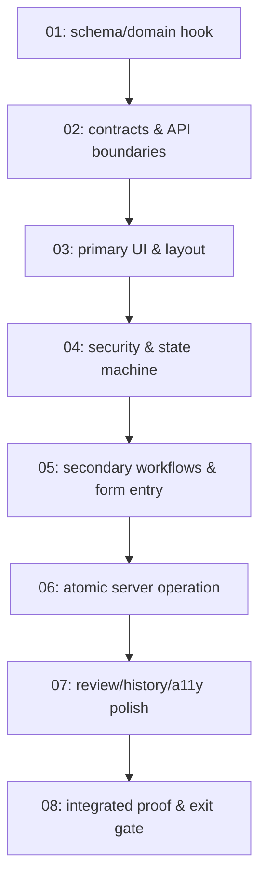

# map.md — DAG, Task Register & Migration Reservations

> Copy to `.scratch/issue-NN-<feature-slug>/map.md`. Keep the task register in sync
> with `issues/NN-*.md` status; update it at every handoff.

# Issue NN — <Feature title> map

## 1. Dependency DAG

<Trim or add edges to match the real dependencies of this epic — do not keep the
generic chain if a task genuinely has no predecessor.>

## 2. Task register

| # | Title | Files (primary) | Depends on | Status | Evidence |
| :--- | :--- | :--- | :--- | :--- | :--- |
| 01 | <schema/domain hook> | `docs/schema/LMS Schema.sql`, `Models/…` | — | Not started | — |
| 02 | <contracts & API boundaries> | `ViewModels/…` | 01 | Not started | — |
| 03 | <primary UI & layout> | `Views/…`, `wwwroot/css/…` | 02 | Not started | — |
| 04 | <security & state machine> | `Controllers/…` | 03 | Not started | — |
| 05 | <secondary workflows> | `Controllers/…`, `Views/…` | 04 | Not started | — |
| 06 | <atomic server operation> | `Controllers/…`, `docs/schema/…` (`sp_*`) | 05 | Not started | — |
| 07 | <review/history/a11y polish> | `Views/…`, `wwwroot/css/…`, `wwwroot/js/…` | 06 | Not started | — |
| 08 | <integrated proof & exit gate> | `.github/workflows/verify.yml` (if touched), evidence | 07 | Not started | — |

Status vocabulary: `Not started` → `In progress` → `Blocked` → `Awaiting PASS` → `Done`.

## 3. Migration reservations (schema)

> Schema changes land in `docs/schema/LMS Schema.sql` **before** the code that reads or
> writes the new object (invariant I4). Reserve the slot here so parallel tickets do not
> collide.

| Slot | Object | Type | Reserved by | Notes |
| :--- | :--- | :--- | :--- | :--- |
| M1 | `<name>` | Table / Column / View / Procedure / Trigger / Index | Issue NN | forward-only |
| M2 | — | — | — | — |

## 4. Risk register

| Risk | Invariant at stake | Mitigation |
| :--- | :--- | :--- |
| <e.g. concurrent quiz submit> | I5 server-authoritative scoring | Server timestamps + `sp_SubmitQuizAttempt` transaction |
| <style bleed into shell CSS> | `AGENTS.md` rule 9 | Scoped selectors + screenshot check of unrelated screens |

## 5. Handoff log

| From → To | Date | Summary | Open issues |
| :--- | :--- | :--- | :--- |
| Task 01 → Task 02 | — | — | — |
