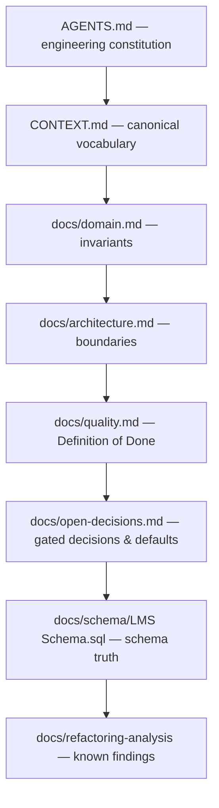

# Documentation map — Academix LMS

This document is the **source authority** for all other documentation. It defines the
reading order for agents and humans, and the rule for resolving conflicts.

## Reading order (do not skip steps)

1. [`AGENTS.md`](../AGENTS.md) — operational constitution: engineering rules, exact
   inner-loop / exit-gate commands, `.scratch/` workflow, human approval gate.
2. [`CONTEXT.md`](../CONTEXT.md) — ubiquitous glossary. Every business term maps to one
   canonical code symbol; never invent synonyms.
3. [`domain.md`](domain.md) — non-negotiable invariants.
4. [`architecture.md`](architecture.md) — runtime boundaries, data flows, extraction rules.
5. [`quality.md`](quality.md) — Definition of Done and verification matrices.
6. [`open-decisions.md`](open-decisions.md) — gated decisions and the engineering defaults
   to build against until each gate closes.
7. [`schema/LMS Schema.sql`](schema/LMS%20Schema.sql) — schema source of truth.
8. [`refactoring-analysis/`](refactoring-analysis/README.md) — known findings (F-01…F-18)
   and the proposed refactoring sessions; read before touching those areas.
9. The active ticket under [`.scratch/`](../.scratch/).

## Conflict resolution rule

When two documents disagree, the higher entry in this list wins:

Two special rules:

- **Invariants beat convenience.** If `AGENTS.md` states a rule that would violate an
  invariant in `domain.md`, the invariant wins and `AGENTS.md` must be corrected.
- **Findings are not requirements.** `refactoring-analysis/findings.md` documents
  *current* defects; it never licenses reproducing them in new code.

## Document register

| Document | Purpose | Authority |
| :--- | :--- | :--- |
| `AGENTS.md` (root) | Working agreement: rules, commands, gates | Engineering process |
| `CONTEXT.md` (root) | Business term → code symbol dictionary | Naming |
| `docs/README.md` | Reading order + conflict rule (this file) | Precedence |
| `docs/domain.md` | Invariants: precision, integrity, security | Overrules convenience |
| `docs/architecture.md` | Processes, boundaries, data flows | Structure |
| `docs/quality.md` | Definition of Done, test/evidence matrix | Verification |
| `docs/open-decisions.md` | Gated decisions + engineering defaults | Prevents guessing |
| `docs/schema/LMS Schema.sql` | Tables, views, triggers, procedures | Schema truth |
| `docs/refactoring-analysis/` | Static review findings + refactoring sessions | Known defects |
| `.scratch/issue-NN-*/` | Active epics, specs, task tickets, evidence | Current work |

## How to update documentation

- A change that alters an invariant, a boundary, or a Definition-of-Done rule **must**
  update the owning document in the same commit as the code change.
- New business terms must be added to `CONTEXT.md` before they appear in new symbols.
- Structural decisions move from `open-decisions.md` into `architecture.md` (or
  `domain.md`) only when their gate closes, with the evidence recorded in the decision
  row.
