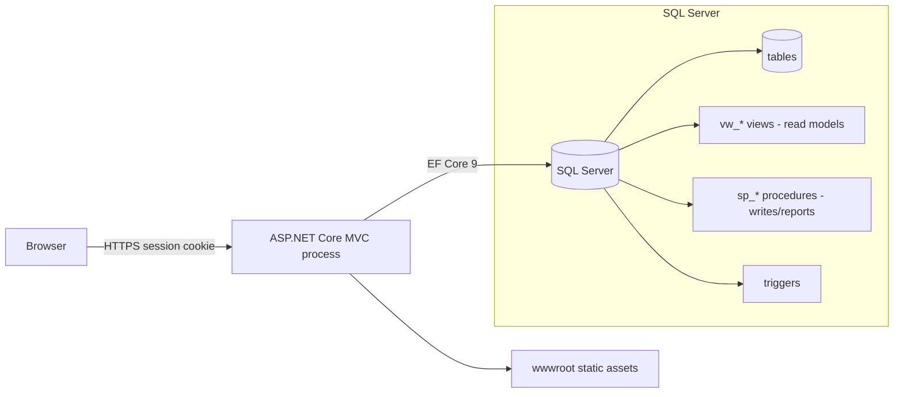

# docs/architecture.md — System Boundaries & Structural Constraints

Structural authority for the Academix LMS. Changes that move data across a boundary, add
a process, or alter ownership of a table must update this document in the same change.

## 1. Runtime shape

One deployable: an ASP.NET Core 8 MVC application (`Program.cs`) hosting Kestrel, serving
Razor HTML, static assets, and a Development-only Swagger endpoint. There are **no**
background workers, message brokers, microservices, or IPC channels. All portals (Admin,
Instructor, Student) execute inside this single process. Two non-portal controllers also
run here: `AuthController`/`HomeController`, and `PreviewController` — an **unauthenticated**
design-time surface (`GET /preview/view?name=<X>` renders `Views/Admin/<X>.cshtml` with no
session or role gate; audit recommendation: gate or remove it).



## 2. Request path & layers

```text
Razor view (Views/**)
  -> Controller action (Controllers/**)          [auth gate + role gate + input binding]
     -> ViewModel (ViewModels/**)               [shape of input/output; never persisted]
        -> LmsContext (Models/LmsContext.cs)    [EF Core entities + keyless vw_* mappings]
           -> SQL Server (tables / vw_* / sp_*)
```

Rules for this path:

- Controllers query `LmsContext` directly. There is no repository/service layer today;
  introducing one is justified only per-ticket, never as a blanket refactor
  (`AGENTS.md` rule 1).
- Write flows may use stored procedures invoked via raw SQL
  (`_context.Database.ExecuteSqlRawAsync("EXEC sp_…")`) — the only such call today is the
  canonical, parameterized `sp_SubmitQuizAttempt` in `StudentController` (`@p0` binding).
- Read/report flows map keyless entities to views with `.ToView("vw_…")` in
  `LmsContext` (`vw_InstitutionSummary`, `vw_QuizzesWithStats`, … — 23 views, identical to
  the 23 `CREATE VIEW` statements in the schema script).
- ViewModels are presentation contracts. Never map a ViewModel straight into a table
  entity without an explicit projection step in the action.

## 3. Trust boundaries

| Boundary | What crosses | Rule |
| :--- | :--- | :--- |
| Browser → app | HTML forms, JSON AJAX payloads, session cookie | Treat all input as hostile: validate models, verify anti-forgery (I8), re-check role + `IsActive` server-side. |
| App → SQL Server | Parameterized EF queries and `EXEC sp_*` calls | Parameterization only; no string-concatenated SQL. |
| Session cookie → identity | `UserId` (`int`) in `HttpContext.Session` | HttpOnly, SameSite=Lax, 30-minute idle timeout. Role is re-read from the database per request **only** by the Admin/Instructor guards; `StudentController` checks session presence alone, and `IsActive` is checked only at login — that gap is finding **F-08**, not a property of the cookie. |
| Client → scoring | Quiz option IDs, timers | Untrusted (I5). Scoring and deadlines stay server-side. |

There is no third-party service boundary: no external APIs, no file storage service, no
queued jobs. Any future external integration must be introduced as an explicit,
config-driven boundary with a documented failure mode.

## 4. Data ownership

- **Tables** (owned by `docs/schema/LMS Schema.sql`): `User`, `Institution`,
  `AcademicTerm`, `Course`, `CourseEnrollment`, `Lecture`, `LearningAsset`,
  `Quiz`/`QuizQuestion`/`QuestionOption`/`QuizAttempt`/`QuizResponse`,
  `GradeBook`/`Grade`, `Transcript`/`TranscriptEntry`, `Notification`(+Type/Template),
  `StudentProfile`/`InstructorProfile`, AI entities.
- **Views (`vw_*`)**: read models for dashboards and reports. The application may read
  them; it must not write through them.
- **Procedures (`sp_*`)**: multi-step writes with integrity rules — 18 defined in the
  script (canonical: `sp_SubmitQuizAttempt`, `sp_EnrollStudent`,
  `sp_AssignGradeToQuizAttempt`, `sp_UpdateStudentGPA`, `sp_SendNotification`). Only
  `sp_SubmitQuizAttempt` is executed by application code today; the rest are available
  schema surface. Multi-row mutations with business rules belong here, not in controller
  code.
- **Functions (`fn_*`)**: 13 scalar helpers defined in the script; none are referenced by
  application code today.
- **Triggers**: schema-level integrity backstops declared in the SQL script (5, all
  mirrored by `HasTrigger` in `LmsContext`).

Ownership test: if code needs a column that the script does not have, the script changes
first (I4).

## 5. Environment split

| Concern | Development | Non-Development |
| :--- | :--- | :--- |
| Swagger | Enabled (`app.UseSwagger()`), `/swagger` | Not registered |
| Bootstrap admin | Seeded when `BootstrapAdmin:Password` is non-empty | Never seeded |
| Errors | Developer exception page | `/Home/Error` + HSTS |
| Connection string | `appsettings.Development.json` (gitignored) | `appsettings.json` + environment variables |

## 6. Frontend boundaries

- Browser JS lives in `wwwroot/js/`: `site.js`, `theme_toggle.js`, `toast.js`,
  `form-validation.js`, plus feature scripts (`account-settings.js`, `announcements.js`).
  Only `theme_toggle.js` and the feature scripts are loaded by views today; `site.js`,
  `toast.js`, and `form-validation.js` are currently unreferenced.
- CSS lives in `wwwroot/css/`: `main.css` is the shell loaded by `_Layout`/`_LoginLayout`;
  `site.css`, `themes.css`, `header.css`, and `utilities.css` exist but are unreferenced
  (marked deprecated in-file). Feature styles live under `wwwroot/css/pages/`.
- **Third-party runtime assets are CDN-loaded today**, not vendored: Bootstrap 5.3.3,
  Font Awesome, Google Fonts/Material Symbols, and Chart.js (`Views/Student/Dashboard.cshtml`)
  come from jsdelivr/cdnjs/googleapis in `_Layout`, `_LoginLayout`, and page views.
  `wwwroot/lib/` holds Bootstrap, jQuery, and jQuery-validation copies that are largely
  unreferenced (only the validation partial touches them, and it is not rendered).
  Treat "no CDN dependencies" as an unmet target, not the current state.
- Feature styles are scoped under a feature root class; global selectors are reserved for
  the shared shell (`AGENTS.md` rule 9).
- Dialogs are custom modals; native `alert`/`confirm` are prohibited (`AGENTS.md` rule 8).
  **Audit note:** 12 call sites across 6 views still violate this — tracked as debt; do
  not add new ones (`wwwroot/js/toast.js` already provides the confirm modal).

## 7. Extraction criteria (when a module earns its own process/package)

Nothing is extracted speculatively. A slice is a candidate only when **all** hold:

1. Its data ownership is already isolated (its own tables or a documented view boundary).
2. Its change cadence differs sharply from the MVC core (e.g. AI generation workloads).
3. It has an integration seam that can be contract-tested (HTTP, queue, or file).
4. The team accepts the operational cost of a second deployable.

Until then: same process, same `LmsContext`, one deployable.

## 8. Known structural debt

`docs/refactoring-analysis/findings.md` records the structural risks (authorization gaps
F-03/F-04, client-trusted scoring F-05/F-06, `EnsureCreated` vs SQL script F-09,
controller coupling F-14). Fixing them is scheduled through refactoring sessions, not by
redesigning the architecture ad hoc.
