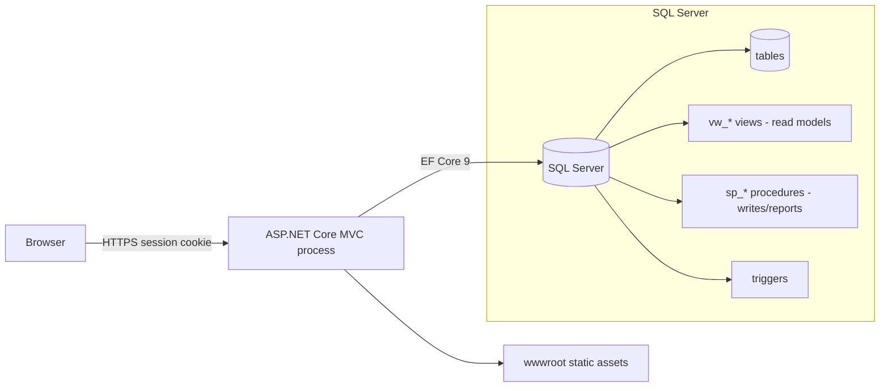

# docs/architecture.md — System Boundaries & Structural Constraints

Structural authority for the Academix LMS. Changes that move data across a boundary, add
a process, or alter ownership of a table must update this document in the same change.

## 1. Runtime shape

One deployable: an ASP.NET Core 8 MVC application (`Program.cs`) hosting Kestrel, serving
Razor HTML, static assets, and a Development-only Swagger endpoint. There are **no**
background workers, message brokers, microservices, or IPC channels. All portals (Admin,
Instructor, Student) execute inside this single process.



## 2. Request path & layers

```text
Razor view (Views/**)
  -> Controller action (Controllers/**)          [auth gate + role gate + input binding]
     -> ViewModel (ViewModels/**)               [shape of input/output; never persisted]
        -> LmsContext (Models/LmsContext.cs)    [EF Core entities + keyless vw_* mappings]
           -> SQL Server (tables / vw_* / sp_*)
```

Rules for this path:

- Controllers query `LmsContext` directly. There is no repository/service layer today;
  introducing one is justified only per-ticket, never as a blanket refactor
  (`AGENTS.md` rule 1).
- Write flows that need database logic use stored procedures invoked via raw SQL
  (`_context.Database.ExecuteSqlRawAsync("EXEC sp_…")`) — the canonical example is
  `sp_SubmitQuizAttempt` in `StudentController`.
- Read/report flows map keyless entities to views with `.ToView("vw_…")` in
  `LmsContext` (`vw_InstitutionSummary`, `vw_QuizzesWithStats`, … — 24 views).
- ViewModels are presentation contracts. Never map a ViewModel straight into a table
  entity without an explicit projection step in the action.

## 3. Trust boundaries

| Boundary | What crosses | Rule |
| :--- | :--- | :--- |
| Browser → app | HTML forms, JSON AJAX payloads, session cookie | Treat all input as hostile: validate models, verify anti-forgery (I8), re-check role + `IsActive` server-side. |
| App → SQL Server | Parameterized EF queries and `EXEC sp_*` calls | Parameterization only; no string-concatenated SQL. |
| Session cookie → identity | `UserId` (`int`) in `HttpContext.Session` | HttpOnly, SameSite=Lax, 30-minute idle timeout; role and active checks re-derived from the database per request. |
| Client → scoring | Quiz option IDs, timers | Untrusted (I5). Scoring and deadlines stay server-side. |

There is no third-party service boundary: no external APIs, no file storage service, no
queued jobs. Any future external integration must be introduced as an explicit,
config-driven boundary with a documented failure mode.

## 4. Data ownership

- **Tables** (owned by `docs/schema/LMS Schema.sql`): `User`, `Institution`,
  `AcademicTerm`, `Course`, `CourseEnrollment`, `Lecture`, `LearningAsset`,
  `Quiz`/`QuizQuestion`/`QuestionOption`/`QuizAttempt`/`QuizResponse`,
  `GradeBook`/`Grade`, `Transcript`/`TranscriptEntry`, `Notification`(+Type/Template),
  `StudentProfile`/`InstructorProfile`, AI entities.
- **Views (`vw_*`)**: read models for dashboards and reports. The application may read
  them; it must not write through them.
- **Procedures (`sp_*`)**: multi-step writes with integrity rules
  (`sp_SubmitQuizAttempt`, `sp_EnrollStudent`, `sp_AssignGradeToQuizAttempt`,
  `sp_UpdateStudentGPA`, `sp_SendNotification`, …). Multi-row mutations with business
  rules belong here, not in controller code.
- **Triggers**: schema-level integrity backstops declared in the SQL script.

Ownership test: if code needs a column that the script does not have, the script changes
first (I4).

## 5. Environment split

| Concern | Development | Non-Development |
| :--- | :--- | :--- |
| Swagger | Enabled (`app.UseSwagger()`), `/swagger` | Not registered |
| Bootstrap admin | Seeded when `BootstrapAdmin:Password` is non-empty | Never seeded |
| Errors | Developer exception page | `/Home/Error` + HSTS |
| Connection string | `appsettings.Development.json` (gitignored) | `appsettings.json` + environment variables |

## 6. Frontend boundaries

- All browser JS lives in `wwwroot/js/` (site, theme, toast, form-validation, feature
  scripts); all CSS in `wwwroot/css/` (`site.css` global shell, `themes.css`,
  `utilities.css`).
- Feature styles are scoped under a feature root class; global selectors are reserved for
  the shared shell (`AGENTS.md` rule 9).
- Third-party libraries are vendored under `wwwroot/lib/` (Bootstrap, jQuery,
  jQuery-validation, Chart.js) — no CDN dependencies at runtime.
- Dialogs are custom modals; native `alert`/`confirm` are prohibited (`AGENTS.md` rule 8).

## 7. Extraction criteria (when a module earns its own process/package)

Nothing is extracted speculatively. A slice is a candidate only when **all** hold:

1. Its data ownership is already isolated (its own tables or a documented view boundary).
2. Its change cadence differs sharply from the MVC core (e.g. AI generation workloads).
3. It has an integration seam that can be contract-tested (HTTP, queue, or file).
4. The team accepts the operational cost of a second deployable.

Until then: same process, same `LmsContext`, one deployable.

## 8. Known structural debt

`docs/refactoring-analysis/findings.md` records the structural risks (authorization gaps
F-03/F-04, client-trusted scoring F-05/F-06, `EnsureCreated` vs SQL script F-09,
controller coupling F-12). Fixing them is scheduled through refactoring sessions, not by
redesigning the architecture ad hoc.
